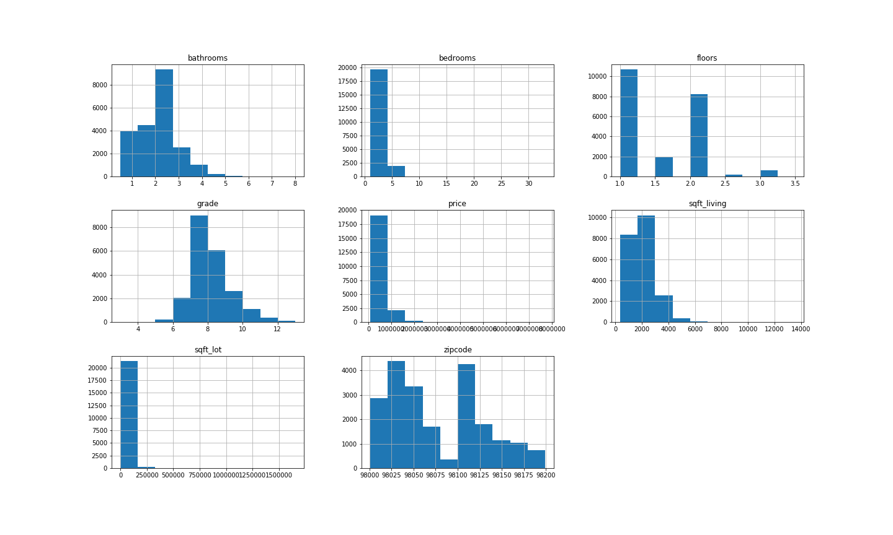
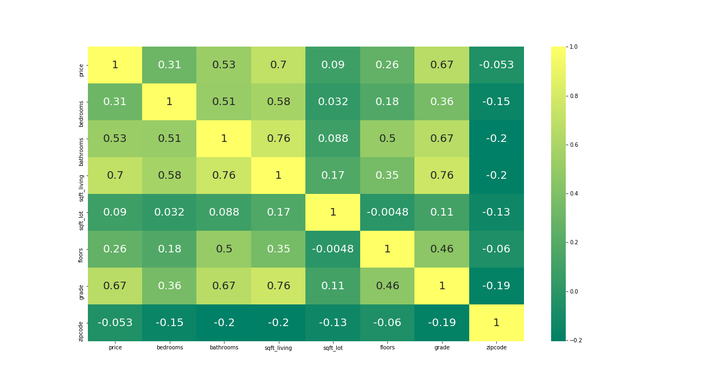
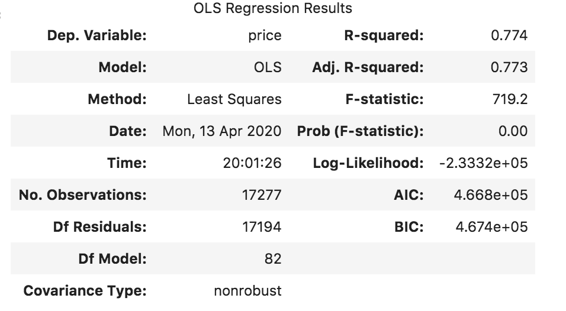
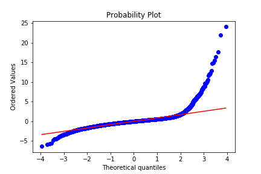
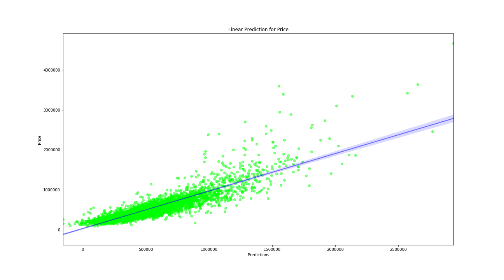

# KC Housing Regression

## Project Purpose and Description

In this project, we looked at the the various features that influence the price of a home in King's County.  We analyzed these features, developed and tested models that would predict the price of the home.

## Tools (all using Python and its various libraries)
   - Pandas
   - Numpy
   - Seaborn
   - Matplotlib
   - Scikit Learn
   
## Data:
The data used was in the form of a csv from Kaggle.

<ins> Features </ins>

Over 20,000 data points

id, date, price, bedrooms, bathrooms, sqft_living, sqft_loft, floors, waterfront, view, condition, grade, sqft_above, sqft_basement, yr_built, yr_renovated, zipcode, latitude, and longitude. 

## Taking a Closer Look at the Data

## Modeling
After cleaning the data, examining various correlations, feature engineering, and determining it the dataset was a good candidate for a Linear Regression, we were able to run a model and achieve an accuracy rate of 77%. 

 
 

## Probability Plot

## Conclusion and Future work

In our final model, we achieved an adjusted r-squared value of 85% using a Ridge Regression.  Using the evaluation metric mean absolute error, we were able to pedict the price of a home within roughly $100,000.  The feature that was most important to the analysis was the zip code.  Homes from a specific neighborhood or area tended to cost more. Although not excellent, the result was adequate.  In the future, we would like to explore using other models such as the Lasso Regression or a Neural Network, as well as exploring the effect of grouping zip codes into specific and measurable zones:  upon the grouping, we would create an interactive geomap of the most expensive areas. 

